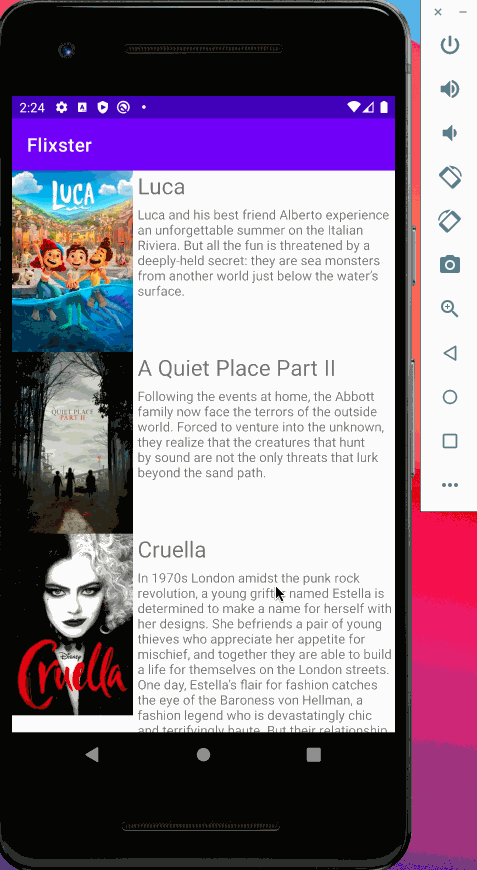
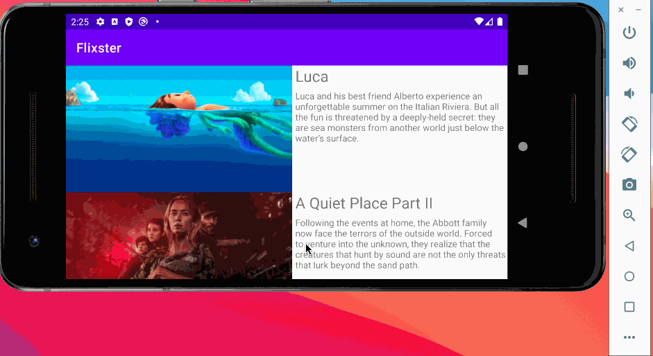

# Project 2 - *Flixster*

**Flixster** is an app that informs the user about the latest movies, allowing the user to see a movie overview, the overall rating of the movie, movie's trailer in youtube and users reviews for each movie!.

This app was developed using the movie database API [tmdb] found at https://developers.themoviedb.org/3

Submitted by: **Jose Angel Del Angel**

Time spent: **20** hours spent in total

## User Stories

The following **required** functionality is completed:

* [x] User can **view a list of the latest movies**
* [x] User can **movie image has a default placeholder** 
* [x] Users are able to use **the app in landscape and portrait mode** 

The following **bonus** features are implemented:

* [x] **Added rounded corners to each movie image**
* [x] **Improved UI through styling and coloring**
* [ ] **Aplied the View Binding Library**
* [x] **Added youtube player view to watch the trailers of each movie**

The following **additional features** were implemented:

* [x] User is able to see movie reviews below the youtube video
* [x] Ui was improved including an icon to the toolbar and changing the main colors of the app in the app theme xml
* [x] Star rating is fixed with the API's data preventing the user from changing the rating
* [x] Included app icon at mipmap

## Video Walkthrough

Here's a walkthrough of implemented user stories:

Here's a walkthrough of portrait functionality:

GIF created with [LiceCap](https://www.cockos.com/licecap/).

## Challenges when developing the app

**Getting youtube video key and passing it through diferent classes:**

Youtube video feature was a whole challenge that involved getting the id of a certain movie, using such id to get the video url and generating the Youtube player view. 

In this challenge the time at wich the youtube url was retrived was crucial since we should already have the url before generating the youtube player view and thus url culdn't be retrivered in the MovieTrailer activity. To solve this we retrived the URL in the MovieDescription activity and wrapped it to pass it to MovieTrailer activity.

**Modern android versions avoiding icons in toolbar**

Modern versions of android made difficult to have an icon displayed inside the toolbar and since many android forums are out of date with that feature a large research was done. 

**Retriving reviews and wrapping two arguments**

In order to get the movie reviews we implemented a process similar to the one found in Youtube Player View, nontheless creating our own recycled view, the required adapter and all the methods required for such recycled view was a challenge. To make this task easier the View Holders in the recycled view are text views instead of complex views.

Since we should use the same movie id to get reviews that would be displayed in the same window as the videos we should pass to the MovieTrailer the youtube video URL and the movie id (two different items) and to achieve this a string array containing both elements was wrapped.

Describe any challenges encountered while building the app.

## License

    Copyright 2021 Jose Angel Del Angel Dominguez

    Licensed under the Apache License, Version 2.0 (the "License");
    you may not use this file except in compliance with the License.
    You may obtain a copy of the License at

        http://www.apache.org/licenses/LICENSE-2.0

    Unless required by applicable law or agreed to in writing, software
    distributed under the License is distributed on an "AS IS" BASIS,
    WITHOUT WARRANTIES OR CONDITIONS OF ANY KIND, either express or implied.
    See the License for the specific language governing permissions and
    limitations under the License.
